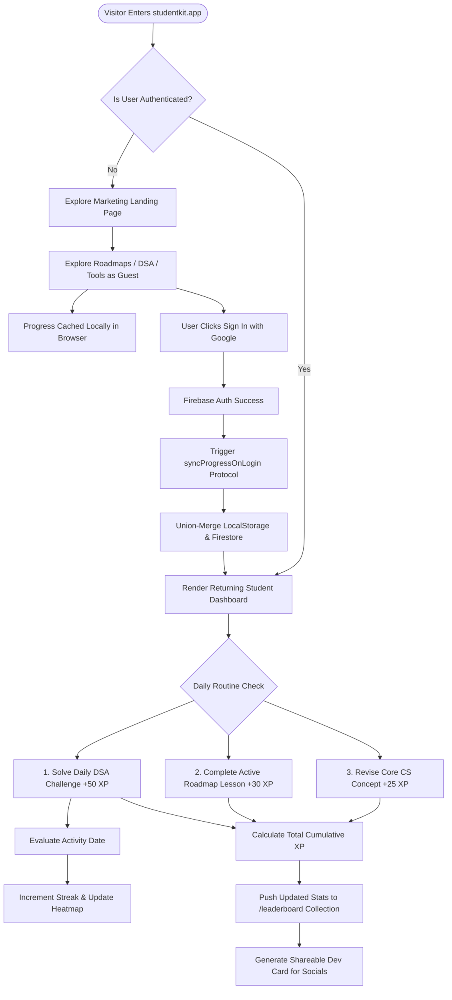
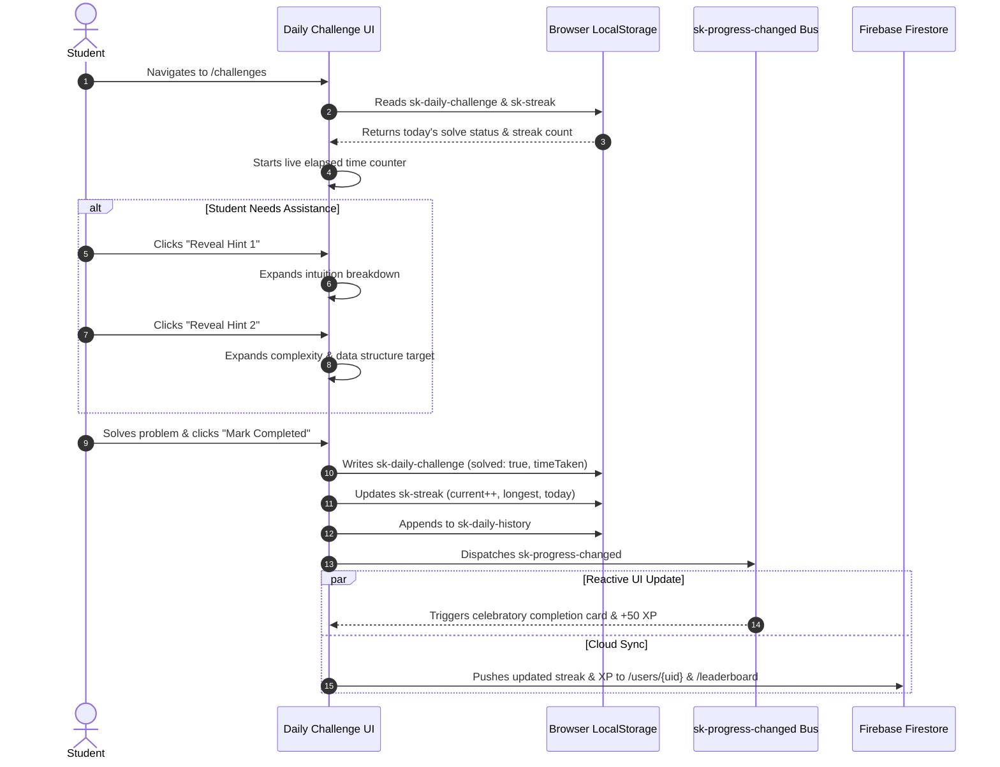

# StudentKit — Complete Project Overview & Technical Architecture Manual

> **Document Version:** 1.0.0  
> **Target System:** StudentKit (`studentkit-app`)  
> **Framework Base:** Next.js 16 (App Router) + React 19 + TypeScript 5 + Tailwind CSS v4 + Motion  
> **Backend & Storage:** Firebase Firestore + Firebase Authentication + Offline LocalStorage Cache  
> **Document Purpose:** Exhaustive engineering specification, feature mechanics, data flow models, user journeys, administrative CMS workflows, and technical audit for the complete StudentKit ecosystem.

---

## 1. Executive Summary & Strategic Vision

StudentKit is an industry-grade, all-in-one engineering career accelerator and academic command center engineered specifically for computer science students, self-taught developers, and prospective software engineers. 

The core thesis of StudentKit is addressing the fragmented nature of student tooling. Typically, an engineering student must juggle 6 to 10 distinct platforms:
- **Learning & Roadmaps:** roadmap.sh, freeCodeCamp
- **Algorithmic Preparation:** LeetCode, NeetCode, Striver A2Z
- **Computer Science Revisions:** GeeksforGeeks, GateSmashers, Sanfoundry
- **Interview & Behavioral Guides:** Glassdoor, Interviewing.io, STAR frameworks
- **Resume Creation:** Overleaf, Reactive Resume, Canva
- **Academic Utilities:** Ad-cluttered GPA calculators, attendance threshold tools, and scattered developer generators.

StudentKit consolidates these workflows into a cohesive, high-density, privacy-first single web application with zero paywalls, zero ads, client-side offline execution, strict design token discipline, and an administrative Content Management System (CMS) powered by Google Cloud Firestore.

---

## 2. Technology Stack & Dependency Matrix

StudentKit is built on modern web primitives emphasizing performance, strict type safety, zero layout shifts (CLS), and fluid micro-interactions.

### 2.1 Core Runtime & Frameworks

| Package | Version | Purpose |
| :--- | :--- | :--- |
| `next` | `16.2.10` | Full-stack meta-framework using App Router, React Server Components (RSC), and Server Actions |
| `react` | `19.2.4` | Component runtime supporting concurrent features, optimistic UI, and latest hooks (`useActionState`) |
| `react-dom` | `19.2.4` | DOM renderer for React 19 |
| `typescript` | `^5.0.0` | Strict static typing across config definitions, state payloads, and component props |
| `tailwindcss` | `^4.0.0` | Atomic utility CSS engine via PostCSS with `@theme inline` mapping |
| `@tailwindcss/postcss` | `^4.0.0` | PostCSS plugin integrating Tailwind v4 with Next.js Turbopack compiler |

### 2.2 Animation & UI Primitives

| Package | Version | Purpose |
| :--- | :--- | :--- |
| `motion` (`motion/react`) | `^13.3.0` | Primary animation engine for spring physics, layout transitions, and `AnimatePresence` |
| `lucide-react` | `^1.24.0` | Lightweight SVG icon library adhering strictly to design token styling |
| `clsx` | `^2.1.1` | Conditional class name joining |
| `tailwind-merge` | `^3.6.0` | Intelligent conflict resolution for utility classes |
| `class-variance-authority`| `^0.7.1` | Type-safe component variant creation |
| `gsap` & `@gsap/react` | `^3.15.0` | Legacy timeline animation library (deprecated in favor of `motion/react`) |

### 2.3 Cloud, Database & Validation

| Package | Version | Purpose |
| :--- | :--- | :--- |
| `firebase` | `^12.16.0` | Client SDK for Firestore (NoSQL database) and Firebase Authentication (Google OAuth + Email) |
| `firebase-admin` | `^14.1.0` | Node.js Server SDK for privileged Firestore migration and server verification |
| `zod` | `^4.4.3` | Runtime schema validation for CMS inputs, user forms, and data migration payloads |
| `react-hook-form` | `^7.81.0` | Performant form state manager with minimal re-renders |
| `@hookform/resolvers` | `^5.4.0` | Zod resolver bridge for React Hook Form |

### 2.4 Markdown & Content Rendering

| Package | Version | Purpose |
| :--- | :--- | :--- |
| `react-markdown` | `^10.1.0` | AST-based markdown renderer for rich tutorials, project specs, and notes |
| `remark-gfm` | `^4.0.1` | GitHub Flavored Markdown plugin (tables, autolinks, task lists, strikethrough) |
| `rehype-highlight` | `^7.0.2` | Syntax highlighting pipeline for code snippets across guides and editorials |

### 2.5 Testing & Quality Assurance

| Package | Version | Purpose |
| :--- | :--- | :--- |
| `vitest` | `^4.1.10` | High-speed unit and integration test runner compatible with Vite/Turbopack |
| `@testing-library/react` | `^16.3.2` | Component behavior testing utilities |
| `@playwright/test` | `^1.61.1` | Cross-browser End-to-End (E2E) testing framework |
| `eslint` & `eslint-config-next` | `^9.0.0` | Static analysis enforcing lint rules and Next.js best practices |
| `prettier` | `^3.9.5` | Code formatting engine |

---

## 3. High-Level Architectural Blueprint

```
+----------------------------------------------------------------------------------------------------+
|                                      NEXT.JS 16 APP ROUTER                                         |
+----------------------------------------------------------------------------------------------------+
|  Public / Student Routes                   |  Protected Admin Routes (RBAC)                        |
|  - /                  - /roadmaps          |  - /admin                                             |
|  - /placement/*       - /projects          |  - /admin/roadmaps  (5-Step Builder)                 |
|  - /challenges        - /resources         |  - /admin/projects  (5-Step Builder)                 |
|  - /resume-builder    - /profile           |  - /admin/resources (Notion-style Editor)             |
|  - /notes             - /leaderboard       |  - /admin/resources/dsa (Editorial Bank)              |
|  - /tools/*           - /open-source       |  - /admin/login                                       |
+--------------------------------------------+-------------------------------------------------------+
                      |                                                     |
                      v                                                     v
+----------------------------------------------------------------------------------------------------+
|                                    FEATURE DOMAIN ARCHITECTURE                                     |
|  src/features/                                                                                     |
|  ├── onboarding/        -> ReturningDashboard, DailySprintBar, DsaPatternRadar, Heatmap             |
|  ├── placement/         -> dsa/, cs/, interview/, placement-hub-view                                |
|  ├── roadmaps/          -> interactive-roadmap, roadmap-detail-client, cms-roadmap-viewer         |
|  ├── projects/          -> public-projects-list, cms-project-viewer, github-projects               |
|  ├── resources/         -> resources-hub, resource-viewer                                           |
|  ├── challenges/        -> daily-challenge-client, weekly-challenge-client                          |
|  ├── resume/            -> resume-builder-client (ATS preview, print engine)                       |
|  ├── profile/           -> profile-dashboard, public-profile-card                                  |
|  ├── leaderboard/       -> leaderboard-client, podium-rankings                                      |
|  ├── notes/             -> notes-page-client (scratchpad, full-text search)                         |
|  └── admin/             -> CMS wizards, migration engines, live preview                             |
+----------------------------------------------------------------------------------------------------+
                      |                                                     |
                      v                                                     v
+--------------------------------------------------+-------------------------------------------------+
|              OFFLINE STORAGE LAYER               |               CLOUD PERSISTENCE LAYER           |
|  Browser LocalStorage                            |  Google Cloud Firestore                         |
|  - sk-dsa-progress     - sk-cs-progress          |  - /users/{uid}        - /roadmaps/{id}         |
|  - sk-interview-progr  - roadmap-progress-${slug}|  - /leaderboard/{uid}  - /projects/{id}         |
|  - sk-daily-challenge  - sk-streak               |  - /analytics/{id}     - /resources/{id}        |
|  - sk-bookmarks        - sk-notes                |  - /admins/{uid}       - /dsa-problems/{id}     |
|  - sk-resume-data                                |  - /subscribers/{email}                         |
+--------------------------------------------------+-------------------------------------------------+
                      |                                                     ^
                      +================ PROGRESS SYNC ENGINE ===============+
                                (src/lib/firebase/user-progress-sync.ts)
                                  - Bi-directional union merge
                                  - Conflict resolution (highest stats win)
                                  - Custom event bus (sk-progress-changed)
```

---

## 4. Design System, Tokens & Visual Foundations

StudentKit strictly rejects arbitrary styling, hardcoded hex values, and ad-hoc Tailwind colors in favor of a formalized CSS Custom Properties (Design Tokens) system defined in `src/app/globals.css`.

### 4.1 Strict Design Constraints
1. **Strict Zero Sparkles Rule:** Zero instances of `Sparkles` or sparkle decorative icons are permitted anywhere in the user interface or marketing materials. Professional software engineering command centers communicate competence through typography, crisp borders, and functional data density rather than gimmicky decorative elements.
2. **100% Token Discipline:** Every color for borders, text, backgrounds, and semantic alerts must reference a variable declared in the theme or use CSS `color-mix()` based on design tokens.
3. **Typography Standards:** Geist Sans / Inter system font for standard UI; Instrument Serif / Georgia for high-level editorial headers; tabular monospace for numbers, timers, and code statistics.
4. **Sharp Geometry:** Consistent `border-radius` scale defaulting to `var(--radius-sm)` (2px) and `var(--radius-md)` (3px) giving a crisp, modern developer aesthetic reminiscent of Linear, Vercel, and GitHub.

### 4.2 Light and Dark Token Specification

```css
:root {
  /* Surface & Background */
  --bg-primary: #F7F7F2;
  --bg-surface: #FFFFFF;
  --bg-dark: #151515;
  --bg-subtle: #F0F0EB;
  --bg-muted: #FAFAF7;

  /* Text & Foreground */
  --text-primary: #111111;
  --text-secondary: #60605B;
  --text-subtle: #898982;
  --text-inverse: #FFFFFF;

  /* Borders */
  --border-default: #DFDFD8;
  --border-soft: #EBEBE5;
  --border-strong: #C8C8C0;

  /* Brand Accents */
  --accent-primary: #C7FF3D;       /* Electric Lime */
  --accent-primary-hover: #B8F030;
  --accent-dark: #151515;          /* Deep Carbon */

  /* Semantic Feedback */
  --color-success: #22C55E;
  --color-warning: #F59E0B;
  --color-error: #EF4444;

  /* Geometry & Shadows */
  --radius-sm: 2px;
  --radius-md: 3px;
  --radius-lg: 4px;
  --radius-full: 9999px;
  --shadow-sm: 0 1px 2px rgba(0, 0, 0, 0.04);
  --shadow-md: 0 2px 8px rgba(0, 0, 0, 0.06);
  --shadow-lg: 0 4px 16px rgba(0, 0, 0, 0.08);
}

[data-theme="dark"] {
  /* Surface & Background */
  --bg-primary: #0F0F0F;
  --bg-surface: #1A1A1A;
  --bg-dark: #FFFFFF;
  --bg-subtle: #242424;
  --bg-muted: #141414;

  /* Text & Foreground */
  --text-primary: #F5F5F5;
  --text-secondary: #A0A09A;
  --text-subtle: #6B6B65;
  --text-inverse: #0F0F0F;

  /* Borders */
  --border-default: #333330;
  --border-soft: #272724;
  --border-strong: #444440;

  /* Brand Inversion for Dark Theme Readability */
  --accent-primary: #111111;       /* Dark button text background */
  --accent-primary-hover: #222222;
  --accent-dark: #C7FF3D;          /* Lime primary highlight */

  /* Shadows */
  --shadow-sm: 0 1px 2px rgba(0, 0, 0, 0.3);
  --shadow-md: 0 2px 8px rgba(0, 0, 0, 0.4);
  --shadow-lg: 0 4px 16px rgba(0, 0, 0, 0.5);
}
```

---

## 5. Client State, Offline-First Persistence & Synchronization

StudentKit is engineered to function 100% offline without requiring account creation. When a user creates an account or logs in via Firebase Google Authentication, an optimistic synchronization protocol merges their guest progress with their remote Firestore profile.

### 5.1 Storage Key Registry

| Storage Key | Data Format | Module Owner | Description |
| :--- | :--- | :--- | :--- |
| `sk-streak` | `StreakData` (JSON) | `user-progress.ts` | Tracks current streak, longest streak, active dates, and total days |
| `sk-bookmarks` | `Bookmark[]` (JSON) | `user-progress.ts` | Array of pinned tools, roadmaps, and projects |
| `sk-notes` | `NoteItem[]` (JSON) | `notes-page-client.tsx` | Array of text notes attached to specific bookmarks |
| `sk-dsa-progress` | `Record<string, boolean>` | `dsa-sheet-view.tsx` | Map of problem ID to boolean completion state |
| `sk-cs-progress` | `Record<string, boolean>` | `cs-fundamentals-view.tsx` | Map of CS subtopic concept ID to completion state |
| `sk-interview-progress` | `Record<string, boolean>` | `interview-view.tsx` | Map of checklist/question IDs to completed state |
| `roadmap-progress-${slug}` | `Record<string, boolean>` | `interactive-roadmap.tsx` | Map of topic IDs to completion state for a given roadmap |
| `roadmap-variant-${slug}` | `string` (plain text) | `interactive-roadmap.tsx` | Selected technology stack variant (e.g. `node` vs `python`) |
| `sk-project-progress-${slug}`| `Record<string, boolean>` | `cms-project-viewer.tsx` | Map of project task IDs to completed state |
| `sk-daily-challenge` | `DailyState` (JSON) | `daily-challenge-client.tsx` | Today's challenge solved flag, time taken, and hint index |
| `sk-daily-history` | `DailyRecord[]` (JSON) | `daily-challenge-client.tsx` | 30-day historical log of daily challenges solved |
| `sk-weekly-challenge` | `WeeklyState` (JSON) | `weekly-challenge-client.tsx` | Current week's problem set completion array |
| `sk-challenge-history` | `WeeklyRecord[]` (JSON) | `weekly-challenge-client.tsx` | Historical weekly contest completions |
| `sk-resume-data` | `ResumeData` (JSON) | `resume-builder-client.tsx` | Full ATS resume draft structure |

### 5.2 The Progress Synchronization Protocol

The synchronization engine in `src/lib/firebase/user-progress-sync.ts` implements a resilient union-merge strategy:

```typescript
function mergeProgress(local: UserProgressData, cloud: UserProgressData): UserProgressData {
  // Streak: Retain the instance with the higher total active days
  const streak = local.streak.totalActiveDays >= cloud.streak.totalActiveDays 
    ? local.streak 
    : cloud.streak;

  // DSA and CS progress: Mathematical set union of all solved IDs
  const dsaProgress = { ...cloud.dsaProgress, ...local.dsaProgress };
  const csProgress = { ...cloud.csProgress, ...local.csProgress };

  // Roadmap progress: Deep merge per roadmap slug
  const allSlugs = new Set([...Object.keys(local.roadmapProgress), ...Object.keys(cloud.roadmapProgress)]);
  const roadmapProgress: Record<string, Record<string, boolean>> = {};
  for (const slug of allSlugs) {
    roadmapProgress[slug] = { 
      ...(cloud.roadmapProgress[slug] || {}), 
      ...(local.roadmapProgress[slug] || {}) 
    };
  }

  // Bookmarks: Unique deduplication keyed by type:slug
  const bookmarkMap = new Map<string, any>();
  for (const b of [...(cloud.bookmarks || []), ...(local.bookmarks || [])]) {
    bookmarkMap.set(`${b.type}:${b.slug}`, b);
  }
  const bookmarks = [...bookmarkMap.values()];

  return { streak, dsaProgress, csProgress, roadmapProgress, bookmarks };
}
```

### 5.3 Decoupled Event-Driven Re-rendering
To avoid heavy React context trees or prop drilling across deeply nested widgets, StudentKit utilizes a native Custom Event bus:
- Trigger: `emitProgressChanged()` dispatches `new Event('sk-progress-changed')` on `window`.
- Listeners: Components like `ReturningDashboard`, `Header`, `PublicProfileCard`, and `DailySprintBar` register event listeners on `sk-progress-changed`.
- Result: Instant, zero-lag, reactive UI updates across widgets when any problem, milestone, or topic is checked anywhere in the app.

---

## 6. Complete Feature Breakdown: Learn Pillar

The Learn Pillar equips students with step-by-step engineering tracks, curated theoretical deep dives, and daily algorithmic discipline.

```
+----------------------------------------------------------------------------------------------------+
|                                           LEARN PILLAR                                             |
+----------------------------------------------------------------------------------------------------+
|                                                                                                    |
|   +--------------------------+  +--------------------------+  +--------------------------------+   |
|   | 1. Interactive Roadmaps  |  | 2. Masterclass Guides    |  | 3. Daily & Weekly Challenges   |   |
|   |    (/roadmaps)           |  |    (/guides)             |  |    (/challenges)               |   |
|   |                          |  |                          |  |                                |   |
|   |  - 9 Career Blueprints   |  |  - Architectural Primers |  |  - 3-Stage Progressive Hints   |   |
|   |  - Linear Stage Tree     |  |  - In-Depth Deep Dives   |  |  - Interactive Timer Engine    |   |
|   |  - Multi-Stack Variants  |  |  - Code Spec Diagrams    |  |  - Real-Time Streak Injection  |   |
|   |  - Milestone Checklists  |  |  - Reading Time Estimates|  |  - +50 XP Reward Calculation   |   |
|   +--------------------------+  +--------------------------+  +--------------------------------+   |
|                 |                             |                                 |                  |
|                 +-----------------------------+---------------------------------+                  |
|                                               |                                                    |
|                                               v                                                    |
|                              +----------------------------------+                                  |
|                              | 4. Knowledge Resources Hub       |                                  |
|                              |    (/resources)                  |                                  |
|                              |                                  |                                  |
|                              |  - Multi-Category Filtering      |                                  |
|                              |  - Markdown Article Viewer       |                                  |
|                              |  - CMS Staged Articles           |                                  |
|                              +----------------------------------+                                  |
+----------------------------------------------------------------------------------------------------+
```

### 6.1 Interactive Learning Roadmaps (`/roadmaps`, `/roadmaps/view`)
- **Supported Career Tracks:** 9 full curriculum roadmaps defined in `src/config/roadmaps/`:
  1. Full-Stack Development
  2. AI & Machine Learning Engineer
  3. DevOps & Cloud Engineering
  4. Cybersecurity Analyst
  5. Modern Frontend Engineer
  6. Distributed Backend Engineer
  7. Cross-Platform Mobile Engineer
  8. Campus Placement & Technical Interview Prep
  9. Object-Oriented Programming (OOP) Mastery
- **Data Architecture:** Each roadmap is organized hierarchically: `Roadmap` -> `Stage[]` -> `Topic[]` -> `Subtopic[]`.
- **Stack Variants:** Supports technology variants (e.g. Backend roadmap allows switching between Node.js/TypeScript, Python/FastAPI, and Go/Gin). Variant state is cached in `roadmap-variant-${slug}`.
- **Progress Tracking:** Stored as a map `{ [topicId: string]: boolean }` in `roadmap-progress-${slug}`. The completion percentage is computed dynamically as:
  $$\text{Completion \%} = \text{round}\left(\frac{\text{Solved Topics Count}}{\text{Total Topics Count}} \times 100\right)$$
- **RSC / Dual-Source Strategy:** The page queries Firestore `/roadmaps/{slug}` first. If no Firestore document exists or network connectivity fails, it transparently falls back to `src/config/roadmaps/`.

### 6.2 Curated Guides & Masterclasses (`/guides`, `/guides/[slug]`)
- **Purpose:** In-depth engineering masterclasses bridging the gap between collegiate textbook theory and production cloud software engineering.
- **Topics Covered:**
  - Distributed In-Memory Caching (Cache-aside, write-through, LRU eviction algorithms)
  - SQL vs NoSQL: Relational schema design vs Document/Wide-Column tradeoffs
  - Modern Authentication: JWT, OAuth 2.0, PKCE, Refresh Token Rotation, and session fixation defense
- **Viewer Features:** Server-rendered Next.js dynamic routes (`/guides/[slug]`), estimated reading time counters, difficulty tags, architectural text diagrams, and syntax-highlighted code implementations.

### 6.3 Knowledge Resources Hub (`/resources`, `/resources/view`)
- **Content Taxonomy:** Filterable articles grouped under 5 technical disciplines:
  - `dsa`: Algorithmic pattern explanations and mathematical foundations
  - `concepts`: Core operating systems, concurrency, and memory management
  - `guides`: Step-by-step developer environment and CLI setups
  - `career`: Cold email templates, salary negotiation tactics, and portfolio strategies
  - `system-design`: High-level architecture, rate limiting, and database sharding
- **Integration:** Powered directly by the Admin CMS Firestore collection `/resources`. Staged content transitions from `draft` to `published` with automatic slug generation.

### 6.4 Daily & Weekly Coding Challenges (`/challenges`)
- **Daily Challenge Routine:** Promotes consistent problem-solving habits through a curated "One Problem a Day" flow:
  - **Interactive Countdown Timer:** Tracks elapsed time in `MM:SS` format.
  - **3-Stage Progressive Hint Engine:**
    - Stage 1: Problem breakdown & naive intuition
    - Stage 2: Time/Space complexity target & optimal data structure recommendation
    - Stage 3: Full pseudo-code and edge case considerations
  - **Solution Reveal:** Complete, syntax-highlighted optimal code solution (Python / C++ / Java / TypeScript) with complexity analysis.
  - **Streak & XP Rewards:** Solved state updates `sk-daily-challenge`, records activity in `sk-streak`, appends record to `sk-daily-history`, and awards +50 XP.
- **Weekly Contest Challenge:** A curated set of 3 problems (Easy, Medium, Hard) refreshed every Sunday midnight. Completing the full trifecta awards +150 XP and a bonus streak multiplier.

---

## 7. Complete Feature Breakdown: Build Pillar

The Build Pillar focuses on real-world software development, transitioning students away from trivial todo-list tutorials toward portfolio projects that impress senior hiring managers.

```
+----------------------------------------------------------------------------------------------------+
|                                           BUILD PILLAR                                             |
+----------------------------------------------------------------------------------------------------+
|                                                                                                    |
|    +------------------------------------------------------------------------------------------+    |
|    |  1. Guided Real-World Project Blueprints (/projects, /projects/view)                     |    |
|    |                                                                                          |    |
|    |   6 Production Architectures:                                                            |    |
|    |   • Collaborative Real-Time Kanban     (Next.js 15, WebSockets, Redis, PostgreSQL)       |    |
|    |   • Distributed In-Memory Cache Engine (Go, TCP Sockets, Raft Consensus, LRU Cache)      |    |
|    |   • AI Research Synthesis Engine       (Python, LangChain, pgvector, FastAPI)            |    |
|    |   • Event-Driven E-Commerce API        (Node.js, Kafka / RabbitMQ, Microservices)        |    |
|    |   • Resilient Offline-First PWA        (TypeScript, IndexedDB, Service Workers)          |    |
|    |   • Real-Time Dev Performance Profiler (Rust, eBPF, WebAssembly, React Dashboard)        |    |
|    |                                                                                          |    |
|    |   Blueprint Specifications:                                                              |    |
|    |   - System Architecture Diagram & Data Flow                                              |    |
|    |   - Recommended Production Directory Tree Layout                                         |    |
|    |   - Phased Engineering Milestones with Interactive Subtask Checklists                    |    |
|    |   - LocalStorage Task Persistence: sk-project-progress-${slug}                           |    |
|    +------------------------------------------------------------------------------------------+    |
|                                                  |                                                 |
|                                                  v                                                 |
|    +------------------------------------------------------------------------------------------+    |
|    |  2. Open Source Directory (/open-source)                                                 |    |
|    |                                                                                          |    |
|    |   - Curated Beginner-to-Intermediate Repositories from GitHub API                        |    |
|    |   - Categorized by Language (TypeScript, Python, Go, Rust, C++)                          |    |
|    |   - Official GitHub Language Accent Indicators (Token Exception)                         |    |
|    |   - First-Contribution Guides & Git Workflow Best Practices                              |    |
|    +------------------------------------------------------------------------------------------+    |
+----------------------------------------------------------------------------------------------------+
```

### 7.1 Guided Real-World Project Blueprints (`/projects`, `/projects/view`)
Defined in `src/config/projects.ts`, these blueprints provide end-to-end specifications for complex engineering systems:
1. **Production Full-Stack SaaS (Collaborative Kanban):** Live cursor tracking, optimistic updates, role permissions, Stripe billing, and PostgreSQL row-level security.
2. **Distributed In-Memory Key-Value Store:** Custom binary wire protocol, multi-threaded connection handling, RESP parser, and append-only file (AOF) persistence.
3. **AI Multimodal Research Agent:** Retrieval-Augmented Generation (RAG), vector similarity search, document chunking pipelines, and token streaming.
4. **Event-Driven E-Commerce API Gateway:** Asynchronous message brokering, saga distributed transaction pattern, idempotency keys, and circuit breakers.
5. **Offline-First Progressive Web App:** Service worker lifecycle, sync queues, IndexedDB object stores, and conflict resolution algorithms.
6. **Systems Profiler & Metrics Visualizer:** CPU sampling, memory allocation hooks, WebAssembly visualization charts, and Prometheus metrics export.

**Milestone Task Engine:** Students interact with structured phased checklists:
- Phase 1: Architecture & Scaffolding
- Phase 2: Core Business Logic & Data Stores
- Phase 3: Networking, Caching & Resilience
- Phase 4: Production Deployment, CI/CD & Observability
Progress is saved locally via `sk-project-progress-${slug}`.

### 7.2 Open Source Directory (`/open-source`)
- **Purpose:** Removes the intimidating barrier to entry for contributing to production open-source software.
- **Repository Metadata:** Provides curated repositories filtered by issue tags: `good-first-issue`, `documentation`, `help-wanted`.
- **Language Palette:** Uses official GitHub hex color dots (e.g., `#3178c6` for TypeScript, `#3572A5` for Python, `#00ADD8` for Go) as a documented, intentional brand exception to the global design token rule.

---

## 8. Complete Feature Breakdown: Prepare Pillar (Placement Hub)

The Placement Hub (`/placement`) is an engineering student's complete technical interview training ground.

```
+----------------------------------------------------------------------------------------------------+
|                                      PREPARE PILLAR (PLACEMENT HUB)                                |
+----------------------------------------------------------------------------------------------------+
|                                                                                                    |
|    +------------------------------------------------------------------------------------------+    |
|    |  1. Curated Algorithmic DSA Sheet (/placement/dsa)                                       |    |
|    |     - 250+ High-Yield Interview Problems across 15 Algorithmic Patterns                  |    |
|    |     - Patterns: Arrays, Two Pointers, Sliding Window, Monotonic Stack, Binary Search,    |    |
|    |       Trees, Graphs, Backtracking, Dynamic Programming, Tries, Heaps, Intervals, Greedy    |    |
|    |     - Company Tagging: Google, Meta, Amazon, Microsoft, Netflix, Apple, Uber             |    |
|    |     - Direct LeetCode & Video Solution Embeds                                            |    |
|    |     - Real-Time Pattern Progress Meter & LocalStorage Persistence: sk-dsa-progress       |    |
|    +------------------------------------------------------------------------------------------+    |
|                    |                                                      |                        |
|                    v                                                      v                        |
|    +-----------------------------------------------+  +---------------------------------------+    |
|    |  2. Core CS Fundamentals Hub                  |  |  3. Technical & Behavioral Interview  |    |
|    |     (/placement/cs-fundamentals)              |  |     (/placement/interview)            |    |
|    |                                               |  |                                       |    |
|    |   4 Core Engineering Subjects:                |  |   - STAR Method Structural Framework  |    |
|    |   • Operating Systems (OS)                    |  |   - 50+ Behavioral Question Rubrics   |    |
|    |   • Database Management Systems (DBMS)        |  |   - HR Round Cheat Sheets             |    |
|    |   • Computer Networks (CN)                    |  |   - ATS Resume Vetting Checklist      |    |
|    |   • Object-Oriented Programming (OOP)         |  |   - Company-Specific Hiring Guides    |    |
|    |                                               |  |     (Tier-1 Tech, Fintech, Startups)  |    |
|    |   - High-Yield Cheat Sheets & Concept Checkers|  |   - Progress Key:                     |    |
|    |   - Storage Key: sk-cs-progress               |  |     sk-interview-progress             |    |
|    +-----------------------------------------------+  +---------------------------------------+    |
+----------------------------------------------------------------------------------------------------+
```

### 8.1 Curated DSA Sheet (`/placement/dsa`)
- **Categorization by Pattern:** Rather than sorting problems arbitrarily, problems are organized into 15 foundational algorithmic patterns in `src/config/placement/dsa-topics.ts`:
  1. Arrays & Hashing (Hash maps, prefix sums, frequency counting)
  2. Two Pointers (Converging pointers, sorted array searches)
  3. Sliding Window (Dynamic size, fixed size, substring counters)
  4. Monotonic Stack (Next greater element, histogram areas)
  5. Binary Search (Search on answer, rotated arrays, boundaries)
  6. Linked Lists (Cycle detection, reversal, merge operations)
  7. Trees & Binary Search Trees (DFS, BFS, lowest common ancestor, diameter)
  8. Tries (Prefix trees, autocomplete indexing)
  9. Heap & Priority Queue (Top-K elements, streaming median)
  10. Backtracking (Subsets, permutations, N-Queens, Sudoku)
  11. Graphs & BFS/DFS (Connected components, topological sort, Dijkstra)
  12. Dynamic Programming: 1D & 2D (Knapsack, LCS, LIS, grid paths)
  13. Greedy Algorithms (Interval scheduling, jump game)
  14. Intervals (Merge intervals, insert interval, non-overlapping)
  15. Bit Manipulation (XOR properties, single number, hamming weight)
- **Problem Attributes:** Title, LeetCode external URL, difficulty badge (`Easy`, `Medium`, `Hard`), video solution URL, and company frequency tags.
- **Components:** `DsaFilterToolbar`, `DsaProblemRow`, `DsaStatsBar`, `DsaTopicAccordion`.

### 8.2 CS Fundamentals Hub (`/placement/cs-fundamentals`)
- **Content Base:** Detailed in `src/config/placement/cs-fundamentals.ts` (over 37 KB of structured interview notes).
- **Core Topics:**
  - **Operating Systems:** Process vs Thread, Scheduling algorithms, Virtual memory & Paging, Deadlocks & Bankers algorithm, System calls, Inter-process communication (IPC).
  - **Database Management Systems:** ACID properties, Normalization (1NF, 2NF, 3NF, BCNF), Indexing structures (B-Trees vs Hash indexes), SQL Joins, Concurrency control & Transactions.
  - **Computer Networks:** OSI 7-Layer vs TCP/IP model, TCP 3-way handshake & 4-way termination, UDP, DNS resolution lifecycle, HTTP/1.1 vs HTTP/2 vs HTTP/3, Subnetting.
  - **Object-Oriented Programming:** The 4 pillars (Encapsulation, Abstraction, Inheritance, Polymorphism), SOLID design principles, Abstract classes vs Interfaces, Composition over inheritance.
- **Concept Completion Engine:** Students check off concepts as they master them. Stored in `sk-cs-progress`.

### 8.3 Technical & Behavioral Interview Hub (`/placement/interview`)
- **STAR Methodology Engine:** Situation, Task, Action, Result framework breakdown with interactive response builder templates.
- **Behavioral Questions Bank:** Over 50 high-yield questions categorized into Conflict Resolution, Leadership, Failure/Deadlines, and Team Collaboration.
- **Company Hiring Tracks:** Specific hiring patterns, round structures (Online Assessment, Technical Screening, System Design, Bar Raiser), and expected question distribution for Tier-1 Tech (Google, Amazon, Microsoft), Fintech (Goldman Sachs, Morgan Stanley), and High-Growth Startups.

---

## 9. Complete Feature Breakdown: Career & Productivity Suite

```
+----------------------------------------------------------------------------------------------------+
|                                    CAREER & PRODUCTIVITY SUITE                                     |
+----------------------------------------------------------------------------------------------------+
|                                                                                                    |
|    +---------------------------------------------+  +-----------------------------------------+    |
|    |  1. ATS Resume Builder (/resume-builder)    |  |  2. Notes & Bookmarks (/notes)          |    |
|    |                                             |  |                                         |    |
|    |   - Real-Time Dual Tab: Edit vs Preview     |  |   - Unified Storage for Saved Items     |    |
|    |   - Single-Page Clean ATS Layout            |  |   - Markdown Note Scratchpad            |    |
|    |   - Dynamic Sections: Personal, Experience, |  |   - Full-Text Search Filtering          |    |
|    |     Education, Projects, Skills, Certs      |  |   - Type Filter: Tools, Roadmaps, Projs |    |
|    |   - Native Print-to-PDF CSS Engine          |  |   - Storage Keys: sk-bookmarks, sk-notes|    |
|    |   - Storage Key: sk-resume-data             |  |                                         |    |
|    +---------------------------------------------+  +-----------------------------------------+    |
|                                                  |                                                 |
|                                                  v                                                 |
|    +------------------------------------------------------------------------------------------+    |
|    |  3. Academic, Developer & Career Utilities (/tools/*)                                    |    |
|    |                                                                                          |    |
|    |   Academic Calculators:                                                                  |    |
|    |   • CGPA Calculator          • SGPA Calculator           • CGPA to Percentage Calculator |    |
|    |   • Attendance Tracker (75% Safe-Zone Rule)              • Marks Percentage Calculator   |    |
|    |                                                                                          |    |
|    |   Developer Utilities:                                                                   |    |
|    |   • JSON Formatter & Minifier • Base64 Encoder / Decoder • Regex Tester & Explainer      |    |
|    |   • .gitignore File Generator • README Generator Engine  • Project Structure ASCII Tool  |    |
|    |   • UUID v4 Generator         • Color Palette Generator  • Client-Side Image Resizer     |    |
|    |   • Signature Resizer (Exams) • Image Compressor (Canvas)• Typing Speed Practice Test   |    |
|    |                                                                                          |    |
|    |   Career Tools:                                                                          |    |
|    |   • CTC to In-Hand Salary Breakdown Calculator (TDS, PF, Gratuity deductions)            |    |
|    +------------------------------------------------------------------------------------------+    |
+----------------------------------------------------------------------------------------------------+
```

### 9.1 ATS Resume Builder (`/resume-builder`)
- **Engine Architecture:** A client-side resume compilation suite in `src/features/resume/resume-builder-client.tsx`.
- **ATS Compliance Guarantees:**
  - Standard system typography (`system-ui`, `-apple-system`, `sans-serif`) ensuring optical character recognition (OCR) parsing.
  - Zero multi-column tables, text boxes, or canvas graphics that break automated resume parsers.
  - Standardized semantic section headers: "Experience", "Education", "Projects", "Skills", "Certifications".
- **Print & PDF Engine:** Features a `@media print` CSS stylesheet:
  ```css
  @media print {
    body * { visibility: hidden; }
    #resume-preview, #resume-preview * { visibility: visible; }
    #resume-preview { 
      position: absolute; 
      top: 0; 
      left: 0; 
      width: 100%; 
      padding: 0.5in; 
    }
  }
  ```
- **Light-Mode Print Guarantee:** While the StudentKit application adapts to dark mode, the resume preview container enforces strict white paper background (`#ffffff`) and dark ink (`#111111`) so PDF exports are always clean and professional.

### 9.2 Personal Notes & Bookmarks Scratchpad (`/notes`)
- **Unified Scratchpad:** Allows students to attach personal revision notes, code snippets, or reminders to any bookmarked resource in the system.
- **Search & Filter:** Real-time filtering by text search query across note content, titles, and item categories (`all`, `tool`, `roadmap`, `project`).
- **Persistence:** Bookmarks are saved in `sk-bookmarks` and custom markdown note content in `sk-notes`.

### 9.3 Academic & Developer Utilities (`/tools/*`)
- **Attendance Safety Tracker:** Solves the universal collegiate dilemma of maintaining 75% mandatory attendance:
  $$\text{Current \%} = \frac{\text{Present Classes}}{\text{Total Held Classes}} \times 100$$
  If current percentage $< 75\%$, calculates exact number of consecutive classes required to attend:
  $$\text{Required Classes} = \lceil 3 \times \text{Total Held} - 4 \times \text{Present} \rceil$$
  If current percentage $\ge 75\%$, calculates safe "bunkable" classes without falling below threshold:
  $$\text{Safe Classes} = \left\lfloor \frac{4 \times \text{Present} - 3 \times \text{Total Held}}{3} \right\rfloor$$
- **Salary Breakdown Calculator:** Translates misleading Cost to Company (CTC) packages into real monthly in-hand deposits by factoring in Basic salary percentages, Employee Provident Fund (EPF 12%), Gratuity (4.81%), Professional Tax, and New vs Old Tax Regime slabs.
- **Client-Side Image Resizers & Compressors:** Uses HTML5 `<canvas>` rendering to resize documents and student signatures to government exam specifications (e.g. UPSC, GATE, JEE limits: 20KB–50KB) with 100% privacy (zero server uploads).

---

## 10. Complete Feature Breakdown: Gamification, Identity & Community

```
+----------------------------------------------------------------------------------------------------+
|                                 GAMIFICATION, IDENTITY & COMMUNITY                                 |
+----------------------------------------------------------------------------------------------------+
|                                                                                                    |
|    +------------------------------------------------------------------------------------------+    |
|    |  1. Returning Student Dashboard (/dashboard, / for auth users)                           |    |
|    |                                                                                          |    |
|    |   Modular High-Density Command Center:                                                   |    |
|    |   • DashboardHeader: User greeting, current streak counter, level badge, XP counter      |    |
|    |   • ActiveRoadmapHero: Primary enrolled career track, progress %, resume lesson CTA      |    |
|    |   • DailySprintBar: 3 micro-goals (Daily DSA, Roadmap Lesson, CS Concept) with checklist |    |
|    |   • DsaPatternRadar: Algorithmic pattern readiness bars across foundational patterns     |    |
|    |   • ActivityHeatmap: GitHub-style 60-day visual contribution streak matrix               |    |
|    |   • DailyChallengeWidget: Problem of the Day challenge card with company tags            |    |
|    |   • LeaderboardWidget: Top-3 learner podium preview and current global standing          |    |
|    +------------------------------------------------------------------------------------------+    |
|                    |                                                      |                        |
|                    v                                                      v                        |
|    +-----------------------------------------------+  +---------------------------------------+    |
|    |  2. Student Profile (/profile)                |  |  3. Public Dev Card (/profile/card)   |    |
|    |                                               |  |                                       |    |
|    |   - Total XP Calculation Engine               |  |   - Digital Shareable Developer Card  |    |
|    |   - Level Progression Ladder (Newbie->Master) |  |   - Solved Problems & Streak Badges   |    |
|    |   - 365-Day Activity Heatmap Grid             |  |   - 1-Click Native Web Share API      |    |
|    |   - Milestone Achievement Badges              |  |   - Social Cards (Twitter / LinkedIn) |    |
|    +-----------------------------------------------+  +---------------------------------------+    |
|                                                    |                                               |
|                                                    v                                               |
|                      +--------------------------------------------------------+                    |
|                      |  4. Global Student Leaderboard (/leaderboard)          |                    |
|                      |                                                        |                    |
|                      |   - Real-Time Global Firestore Ranking                 |                    |
|                      |   - Top-3 Animated Visual Podium Display               |                    |
|                      |   - Ranked List with XP, Streaks & Solved Counters     |                    |
|                      +--------------------------------------------------------+                    |
+----------------------------------------------------------------------------------------------------+
```

### 10.1 Returning Student Dashboard (`/dashboard`, `/` for auth users)
When an authenticated student visits the site, the marketing landing page is replaced by the high-density command center (`ReturningDashboard`) composed of 7 modular widgets in `src/features/onboarding/components/`:
1. `DashboardHeader`: Displays user avatar, greeting, current streak flame, total XP badge, and quick shortcuts.
2. `ActiveRoadmapHero`: Displays the student's highest priority enrolled roadmap with live topic count, progress bar, and "Resume Lesson" deep-link.
3. `DailySprintBar`: 3 actionable daily goals (+50 XP DSA, +30 XP Roadmap, +25 XP CS Review) with completion states.
4. `DsaPatternRadar`: Pattern-by-pattern progress bars showing readiness across foundational interview categories.
5. `ActivityHeatmap`: Visual square grid displaying activity consistency over the past 60 days.
6. `DailyChallengeWidget`: Direct entry point into today's coding problem.
7. `LeaderboardWidget`: Instant preview of top performers and user standing.

### 10.2 Student Profile & Gamification Formula (`/profile`)
The platform calculates experience points (XP) dynamically across all completed student activities:

$$\text{Total XP} = (\text{DSA Solved} \times 10) + (\text{CS Concepts Solved} \times 5) + (\text{Roadmap Topics} \times 8) + (\text{Active Days} \times 3) + \text{Challenge Bonus}$$

**Level Progression Tiers:**
- **Newbie:** $0 \le \text{DSA} < 5$
- **Beginner:** $5 \le \text{DSA} < 25$
- **Intermediate:** $25 \le \text{DSA} < 50$
- **Expert:** $50 \le \text{DSA} < 100$
- **Master:** $\text{DSA} \ge 100$

### 10.3 Public Dev Card (`/profile/card`)
A shareable identity artifact highlighting a student's learning dedication:
- Visual card displaying user's name, avatar, level badge, solved problem count, best streak, total active days, and cumulative XP.
- Web Share API integration triggering native mobile share sheets.
- Pre-filled social sharing links for X (Twitter) and LinkedIn with automated progress bragging rights.

### 10.4 Global Leaderboard (`/leaderboard`)
- Reads from the Firestore collection `/leaderboard`.
- Sorts students globally by descending Total XP.
- Highlights Top 3 with Gold, Silver, and Bronze badges.
- Displays user's active streak, solved problem metrics, and profile avatar.

---

## 11. Complete Feature Breakdown: Administrative CMS Suite (`/admin`)

The Administrative Suite provides non-technical and technical administrators with a full Content Management System (CMS) to create, stage, review, and publish curriculum content without touching git repositories.

```
+----------------------------------------------------------------------------------------------------+
|                                    ADMINISTRATIVE CMS SUITE (/admin)                               |
+----------------------------------------------------------------------------------------------------+
|                                                                                                    |
|    +------------------------------------------------------------------------------------------+    |
|    |  1. Admin Control Center & Analytics Dashboard (/admin)                                  |    |
|    |                                                                                          |    |
|    |   - Real-Time Firestore Metrics: Roadmaps, Projects, Resources (Draft vs Published)      |    |
|    |   - One-Click Static Migration Utility: MigrateRoadmaps                                  |    |
|    |   - Role-Based Access Control (RBAC): /admins/{uid} Firestore verification               |    |
|    +------------------------------------------------------------------------------------------+    |
|            |                              |                             |                          |
|            v                              v                             v                          |
|    +--------------------+       +--------------------+       +--------------------+                |
|    | 2. Roadmaps CMS    |       | 3. Projects CMS    |       | 4. Resources & DSA |                |
|    |    (/admin/        |       |    (/admin/        |       |    (/admin/        |                |
|    |     roadmaps)      |       |     projects)      |       |     resources)     |                |
|    |                    |       |                    |       |                    |                |
|    | 5-Step Builder:    |       | 5-Step Builder:    |       | - Articles CMS with|                |
|    | 1. Basic Info      |       | 1. Basic Info      |       |   NotionEditor     |                |
|    | 2. Details & Tags  |       | 2. Tech Stack      |       | - DSA Problem Bank |                |
|    | 3. Target Audience |       | 3. Milestones/Tasks|       |   Manager:         |                |
|    | 4. Curriculum Tree |       | 4. Architecture    |       |   Multi-language   |                |
|    | 5. Review & Publish|       | 5. Review & Publish|       |   editorial builder|                |
|    +--------------------+       +--------------------+       +--------------------+                |
+----------------------------------------------------------------------------------------------------+
```

### 11.1 Admin Authentication & RBAC
- Routes under `/admin` enforce strict authentication via `src/lib/firebase/auth.ts`.
- Security is backed by Firestore Security Rules checking:
  ```
  function isAdmin() {
    return request.auth != null && exists(/databases/$(database)/documents/admins/$(request.auth.uid));
  }
  ```
- Unauthorized visitors are automatically redirected to `/admin/login`.

### 11.2 One-Click Static Migration Utility (`MigrateRoadmaps`)
- Allows administrators to seed or synchronize hardcoded roadmap configurations from `src/config/roadmaps/` directly into the live Firestore database with a single click.
- Validates data payloads against Zod schemas before executing batch writes.

### 11.3 5-Step Interactive Roadmap Builder (`/admin/roadmaps/new`, `edit`)
- **Step 1: Basic Info:** Roadmap title, auto-slug generation, category selector, difficulty rating, duration estimate, icon, and accent color.
- **Step 2: Details:** Synopsis, long markdown description, prerequisites, and discoverability tags.
- **Step 3: Audience & Outcomes:** Defining student prerequisites and career outcomes.
- **Step 4: Curriculum Tree Builder:** Interactive stage reordering, time estimations, topic insertion, external reference links, and linked guided projects.
- **Step 5: Review & Publish:** Toggle status between `draft` and `published`. Features a live preview mode rendering the curriculum exactly as students will experience it.

### 11.4 5-Step Project Blueprint Builder (`/admin/projects/new`, `edit`)
- Similar multi-step wizard allowing admins to define new real-world portfolio blueprints, specify tech stacks, write architectural specs, and generate structured milestone task lists.

### 11.5 Resources CMS & Notion-Style Editor (`/admin/resources`)
- Integrated markdown WYSIWYG editor (`NotionEditor`) supporting rich headings, bulleted lists, callout boxes, and syntax-highlighted code blocks.
- Category assignment: `dsa`, `concepts`, `guides`, `career`, `system-design`.

### 11.6 DSA Problem Bank Manager (`/admin/resources/dsa`)
- Dedicated problem creator allowing admins to add algorithmic questions with pattern assignment, company tags, LeetCode links, and multi-language editorials (Python, C++, Java, Go, TypeScript) across Brute Force, Better, and Optimal complexities.

---

## 12. Complete User Journeys & End-to-End Flowcharts

### 12.1 Student Discovery, Onboarding & Daily Routine Flow



### 12.2 Problem Solving & Daily Challenge Workflow



### 12.3 Administrative Editorial & Staging Workflow

```mermaid
flowchart TD
    AdminUser[Admin Logs In at /admin/login] --> AuthVerify{Is UID in /admins collection?}
    AuthVerify -- No --> AccessDenied[Access Denied / Redirect to Home]
    AuthVerify -- Yes --> AdminDashboard[Access Admin Control Center]
    
    AdminDashboard --> ActionChoice{Select Admin Operation}
    
    ActionChoice --> BuildRoadmap[New Career Roadmap Wizard]
    ActionChoice --> BuildProject[New Project Blueprint Wizard]
    ActionChoice --> WriteArticle[Write Resource in NotionEditor]
    ActionChoice --> AddDSA[Add Problem to DSA Bank]
    ActionChoice --> RunMigration[Run MigrateRoadmaps Utility]
    
    BuildRoadmap --> StageCurriculum[Define Stages, Topics & Projects]
    StageCurriculum --> StagedDraft[Save as status: 'draft']
    StagedDraft --> LivePreview[Test in /admin/roadmaps/preview]
    LivePreview --> QualityCheck{Meets Quality Standards?}
    
    QualityCheck -- No --> EditDraft[Refine Content & Structure]
    EditDraft --> StagedDraft
    
    QualityCheck -- Yes --> PublishAction[Set status: 'published']
    PublishAction --> FirestoreCommit[Batch Commit to /roadmaps/{slug}]
    FirestoreCommit --> PublicLive[Immediately Available to All Students]
```

---

## 13. Cross-Feature Interconnection & Data Dependency Matrix

| Feature Module | Reads From | Writes To | Dispatches Event | Dependent Features |
| :--- | :--- | :--- | :--- | :--- |
| **Returning Dashboard** | `sk-streak`, `sk-dsa-progress`, `sk-cs-progress`, `roadmap-progress-*`, `/leaderboard` | `sk-streak` | `sk-progress-changed` | Shows summary of all features |
| **DSA Problem Sheet** | `src/config/placement/dsa-topics.ts`, `sk-dsa-progress` | `sk-dsa-progress` | `sk-progress-changed` | Dashboard Pattern Radar, Profile XP |
| **CS Fundamentals** | `src/config/placement/cs-fundamentals.ts`, `sk-cs-progress` | `sk-cs-progress` | `sk-progress-changed` | Dashboard Daily Sprint, Profile XP |
| **Interview Prep** | `src/config/placement/interview.ts`, `sk-interview-progress` | `sk-interview-progress`| None | Placement Hub readiness |
| **Roadmaps Suite** | Firestore `/roadmaps`, `src/config/roadmaps/`, `roadmap-progress-*` | `roadmap-progress-*`, `roadmap-variant-*` | `sk-progress-changed` | Dashboard Active Roadmap Hero, Profile XP |
| **Guided Projects** | `src/config/projects.ts`, `sk-project-progress-*` | `sk-project-progress-*` | None | Notes bookmarks |
| **Daily Challenge** | `sk-daily-challenge`, `sk-streak`, `sk-daily-history` | `sk-daily-challenge`, `sk-streak`, `sk-daily-history` | `sk-progress-changed` | Dashboard Streak, Daily Sprint Bar, Profile XP |
| **Resume Builder** | `sk-resume-data` | `sk-resume-data` | None | Dashboard quick utility shortcut |
| **Notes & Bookmarks**| `sk-bookmarks`, `sk-notes` | `sk-bookmarks`, `sk-notes` | `sk-progress-changed` | Bookmarks from Roadmaps, Tools, Projects |
| **Leaderboard** | Firestore `/leaderboard` | Firestore `/leaderboard/{uid}` | None | Dashboard Leaderboard Widget |
| **Public Dev Card** | `sk-dsa-progress`, `sk-cs-progress`, `sk-streak`, `roadmap-progress-*` | None | None | Social sharing (X, LinkedIn) |
| **Progress Sync** | All LocalStorage keys | Firestore `/users/{uid}`, Firestore `/leaderboard/{uid}` | `sk-progress-changed` | Multi-device user state consistency |

---

## 14. Security Architecture & Firestore RBAC Specification

Security in StudentKit is enforced through a defense-in-depth model combining client validation, Firebase Authentication tokens, and strict Firestore Security Rules.

### 14.1 Security Rules Analysis

```
// Rule Rule Definition
service cloud.firestore {
  match /databases/{database}/documents {

    // Helper: Validates presence in /admins collection
    function isAdmin() {
      return request.auth != null && exists(/databases/$(database)/documents/admins/$(request.auth.uid));
    }

    // 1. Roadmaps Collection: Public reads published; admins have full CRUD
    match /roadmaps/{roadmapId} {
      allow read: if resource.data.status == 'published' || isAdmin();
      allow create, update: if isAdmin();
      allow delete: if isAdmin() && resource.data.status != 'published';
    }

    // 2. Projects Collection: Public reads published; admins have full CRUD
    match /projects/{projectId} {
      allow read: if resource.data.status == 'published' || isAdmin();
      allow create, update: if isAdmin();
      allow delete: if isAdmin() && resource.data.status != 'published';
    }

    // 3. Resources & DSA: Public reads published; admins have full CRUD
    match /resources/{resourceId} {
      allow read: if resource.data.status == 'published' || (request.auth != null && isAdmin());
      allow create, update, delete: if isAdmin();
    }
    match /dsa-problems/{problemId} {
      allow read: if resource.data.status == 'published' || (request.auth != null && isAdmin());
      allow create, update, delete: if isAdmin();
    }

    // 4. Leaderboard: Public read; authenticated users can only write their OWN document
    match /leaderboard/{uid} {
      allow read: if true;
      allow write: if request.auth != null && request.auth.uid == uid;
    }

    // 5. User Profiles: Isolated per user
    match /users/{uid} {
      allow read, write: if request.auth != null && request.auth.uid == uid;
    }

    // 6. Admin Verification Collection: Write is disabled for everyone from client SDK
    match /admins/{uid} {
      allow read: if request.auth != null && request.auth.uid == uid;
      allow write: if false; // Only manageable via Firebase Admin SDK or Console
    }
  }
}
```

### 14.2 Client-Side Data Isolation & Privacy Guarantees
- **Zero Tracker Ingestion:** Calculators (CGPA, Salary, Attendance) and Developer Tools (JSON, Regex, Base64) execute strictly inside the browser V8 sandbox. Zero user inputs or calculated salaries are transmitted across the network.
- **Image Processing Sandbox:** Image compression, signature resizing, and cropping use HTML5 Canvas `toBlob()` / `toDataURL()` locally, ensuring academic documents and personal identity signatures are never exposed to remote servers.

---

## 15. Technical Audit, Known Limitations & Prioritized Refinement Plan

Following a comprehensive line-by-line codebase audit of StudentKit, this section catalogs specific technical debt, hardcoded mock placeholders, and maps out a prioritized engineering roadmap to elevate the platform to top-tier industry standards.

### 15.1 Summary of Identified Technical Gaps

#### 🔴 Critical Logic Flaws
1. **`dsa-pattern-radar.tsx` (Lines 12–19):** Uses static hardcoded completion numbers (`completed: 8`, `completed: 5`). It does not calculate actual progress by matching completed problem IDs in `sk-dsa-progress` against the pattern categories in `dsa-topics.ts`.
2. **`leaderboard-widget.tsx` (Lines 11–15 & 17):** Renders hardcoded mock students (`Arjun M.`, `Priya S.`, `Dev R.`) and defaults `userRank` to a static `#12`, rather than querying the real Firestore `/leaderboard` collection.
3. **`active-roadmap-hero.tsx` (Lines 25–26):** "Next Up" lesson title and duration always default to `stages[0].topics[0]`, completely ignoring which topics the user has already marked as completed.
4. **XP Persistence Fragmentation:** Daily challenge completion rewards +50 XP locally, but this is not synchronized into the profile's unified XP counter or Firestore leaderboard entry unless a full progress sync occurs.

#### 🟡 Functional Depth Gaps
5. **DSA Sheet Problem Search:** Filtering exists for difficulty and topic, but text search by problem title is missing.
6. **Interview Preparation Interactivity:** The behavioral question bank and resume checklist are static read-only views lacking interactive checkmarks or confidence ratings.
7. **Resource Read Tracking:** Articles in `/resources` cannot be marked as read or tracked toward profile XP.
8. **Projects List Progress Preview:** Project cards on `/projects` do not show the percentage of milestones completed.

### 15.2 Prioritized Engineering Roadmap

```
+----------------------------------------------------------------------------------------------------+
|                                    PRIORITIZED REFINEMENT ROADMAP                                  |
+----------------------------------------------------------------------------------------------------+
|                                                                                                    |
|  [PHASE 0: CRITICAL LOGIC & DATA FIDELITY] - IMMEDIATE EXECUTION                                   |
|  ------------------------------------------------------------------------------------------------  |
|  [ ] 1. Rewire DsaPatternRadar: Compute actual solved count per pattern from sk-dsa-progress       |
|  [ ] 2. Connect LeaderboardWidget: Fetch live top-3 students and real user rank from Firestore     |
|  [ ] 3. Fix ActiveRoadmapHero Next-Up Logic: Find first uncompleted topic in active curriculum     |
|  [ ] 4. Unify Global XP Engine: Centralize XP calculation into a single reactive hook/helper       |
|                                                                                                    |
|  [PHASE 1: FEATURE COMPLETENESS & SEARCHABILITY]                                                   |
|  ------------------------------------------------------------------------------------------------  |
|  [ ] 5. Add instant text search to DSA Sheet (/placement/dsa)                                      |
|  [ ] 6. Make Interview Prep questions self-rateable (1-5 star confidence) & persist in storage      |
|  [ ] 7. Add "Mark as Read" functionality to Resources Hub with XP attribution                      |
|  [ ] 8. Display milestone % progress badges on project cards in /projects                          |
|  [ ] 9. Enable problem and article bookmarking directly into /notes                                |
|                                                                                                    |
|  [PHASE 2: INTERACTIVE LEARNING & PRODUCTION POLISH]                                               |
|  ------------------------------------------------------------------------------------------------  |
|  [ ] 10. Implement in-browser code editor/playground for DSA practice                              |
|  [ ] 11. Add drag-and-drop section reordering in ATS Resume Builder                                |
|  [ ] 12. Segment leaderboard rankings by timeframe (Weekly vs Monthly vs All-Time)                 |
|  [ ] 13. Dynamic OpenGraph social preview generation (@vercel/og) for roadmaps and projects       |
|  [ ] 14. E2E Playwright test suite covering auth, roadmap tracking, and resume PDF generation     |
+----------------------------------------------------------------------------------------------------+
```

---

## 16. Maintenance, Testing & Deployment Runbook

### 16.1 Local Development Workflow
```bash
# 1. Install dependencies
npm install

# 2. Run Turbopack development server (Port 3000)
npm run dev

# 3. Execute TypeScript type checking
npm run typecheck

# 4. Execute ESLint static analysis
npm run lint

# 5. Run unit & integration tests
npm run test:run

# 6. Execute production build verification
npm run build
```

### 16.2 Pre-Deployment Validation Checklist
Before deploying changes to production, every pull request must pass the automated validation pipeline:
- [ ] `npm run typecheck`: Returns 0 errors (`tsc --noEmit`).
- [ ] `npm run lint`: Returns 0 errors.
- [ ] `npm run build`: Compiles all 70+ static and dynamic routes successfully.
- [ ] Design Token Verification: No hardcoded `#hex` colors in feature UI components.
- [ ] Symbol Constraint Verification: Zero instances of `Sparkles` icon imported from `lucide-react`.

---

> **Document Maintained By:** Antigravity Engineering Core  
> **Last Verified Build:** Next.js 16.2.10 | Node.js v20+ | Production Ready  
> **Source Repository:** `StudentKit` (Root Workspace)

